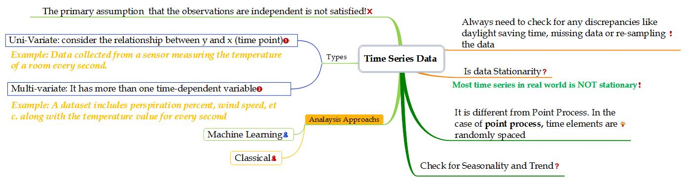
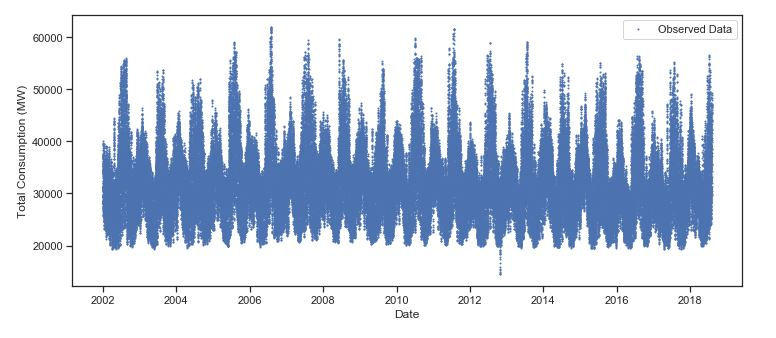

# Investigation of US Energy Consumption 
Energy Consumption forecasting is an essential tool for managers and related utility companies to conduct energy-saving policies or provide more energy sources. This type of data is categorized as a _Time Series_ one. In the following, the outline of this study about the investigation of US Energy Consumption is presented.

## Outline
* Some Notions about Time Series 
* Study Objective
* Available Data
* Methodology
* Results and Discussion

## Some Notions about Time Series  
Time Series is a sequence of measurements of the variable(s) which are collected over time. It has wide applicability in economics, atmospheric science, engineering, etc. The below figure summarizes some notions about time series data ([Original size](https://github.com/MOAMSA/Energy-Consumption-Time-Series/blob/master/Figures/TS_Facts.jpg)).

## Objective
In this study, we will analysis the hourly energy consumption in the United States reported by PJM (the regional transmission organization) to forecast the future.

## Available Data
CSV files containing energy consumption are available for different regions. In the Exploratory Data Analysis section, we will examine, summarize and visualize the data. After exploration in the data set, the Energy consumption of the East part is selected for further analysis. In the below figure, the Hourly Energy Consumption in `MegaWatt` (East part) for the period 2002 to the middle of 2018 is shown. 

## Methodology
In this study, we are going to forecast _Hourly Energy Consumption_ using different methods. At the first step, Exploratory Data Analysis is applied to understand the data which is very important. In the next step and before implementing each method, we will review some basics in order to analyze the data set using the considered method. Using each of methods needs some preparation steps related to the specific aspects of time series data. Both Classical (`SARIMA`) and Machine learning (`SVM` and `LSTM`) approaches are used for the Energy consumption forecasting. 
 In the following, you can find links containing Python Codes and descriptions for three mentioned methods. The structure of the study is as follow:

* [Exploratory Data Analysis](https://github.com/MOAMSA/Investigation-of-US-Energy-Consumption-/blob/master/Exploratory_Data_Analysis.ipynb)
* [Seasonal Autoregressive Integrated Moving Average (SARIMA) Model](https://github.com/MOAMSA/Investigation-of-US-Energy-Consumption-/blob/master/TS_SARIMA.ipynb)
* [Support Vector Machine (SVM) Model](https://github.com/MOAMSA/Investigation-of-US-Energy-Consumption-/blob/master/TS_SVM.ipynb)
* [Long Short-Term Memory network (LSTM) Model](https://github.com/MOAMSA/Investigation-of-US-Energy-Consumption-/blob/master/TS_LSTM.ipynb)

## Results and Discussion
There are several factors that affect the decision to choose a machine learning algorithm.  The data is a key role in deciding which algorithm to be used. Generally, algorithms are sensitive to the size, quality, type (categorical, etc), missing data points, outliers. Also, the allocated time for model training and the level of accuracy are important. Based on the type of data which is time series, a classical approach of SARIMA, SVM model as one of the most popular algorithms, and LSTM with the advantage of handling sequence dependency are used.  
For all methods, different transformations are tried to get the best result. The below table shows the properties of three used methods. Also, the issues raised during the implementation of each method are summarized.

|Method|Split Point|Re-sample Interval|Seasonal Factor|R2 Test|Issues|
|:----------- |:-----------:| :-----------:|:-----------:|:-----------:|:-----------|
|SARIMA|2014-01-01|15 Days| 24|0.70|Memory error using hourly data| 
|SVM|2014-01-01|1 Day|365|0.81|Time Consuming when hourly data is used|
|LSTM|2014-01-01|15 Days| 24|0.76|Time Consuming when hourly data is used, Many parameters need to be optimized|

Although Test R2 is presented as a Metric to evaluate the model, the selection of the optimum model is a challenging task. In addition to metric selection, the strategy of model improvement (Track and refine solution based on new insights) is also important. 

